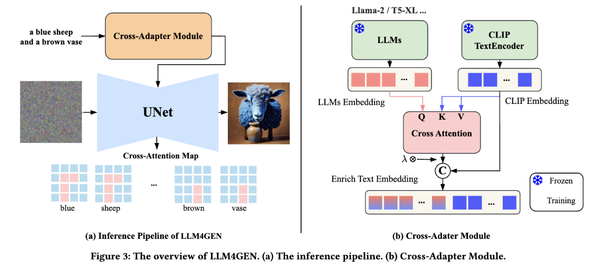
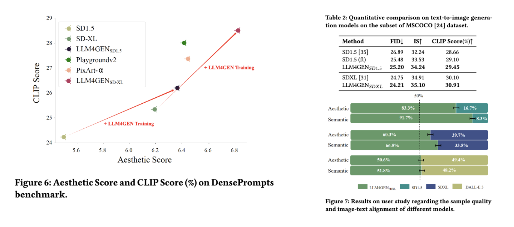

<h1>[AAAI-2025] LLM4GEN: Leveraging Semantic Representation of LLMs for Text-to-Image Generation</h1>

[**Mushui Liu**](https://xiaobul.github.io)<sup>12*</sup> · [**Yuhang Ma**](https://yuhang-ma.github.io/)<sup>2*</sup> · Xinfeng Zhang<sup>2</sup> · [**Zhen Yang**](https://zhenyangcs.github.io/)<sup>1</sup> · Zeng Zhao<sup>2✉</sup> · Bai Liu<sup>2</sup> · Changjie Fan<sup>2</sup> · Zhipeng Hu<sup>2</sup>


<sup>1</sup>Zhejiang University <sup>2</sup>Fuxi AI Lab, NetEase Inc


<a href='https://xiaobul.github.io/LLM4GEN/'></a>
<a href='https://arxiv.org/pdf/2407.00737'></a>

</div>

This paper proposes a framework called LLM4GEN, which enhances the semantic understanding ability of text-to-image diffusion models by leveraging the semantic representation of Large Language Models (LLMs). Through a specially designed Cross-Adapter Module (CAM) that combines the original text features of text-to-image models with LLM features, LLM4GEN can be easily incorporated into various diffusion models as a plug-and-play component and enhances text-to-image generation. 


## Updates
- [2025/01/07] Released Inference Code and Pretrained Models of SD1.5.
- [2024/07/03] Code and pretrained models are coming soon.
- [2024/06/30] 🔥 We release the [paper](https://arxiv.org/pdf/2407.00737) and the [project page](https://xiaobul.github.io/LLM4GEN/).

## Method

The proposed LLM4GEN, which contains a Cross-Adapter Module (CAM) and the UNet, is illustrated in Fig 1. (a). In this paper, we explore stable diffusion as the base text-to-image diffusion model, and the vanilla text encoder is from CLIP. LLM4GEN leverages the strong capability of LLMs to assist in text-to-image generation. The CAM extracts the representation of a given prompt via the combination of LLM and CLIP text encoder. The fused text embedding is enhanced by leveraging the pre-trained knowledge of LLMs through the simple yet effective CAM. By feeding the fused text embedding, LLM4GEN iteratively denoises the latent vectors with the UNet and decodes the final vector into an image with the VAE.



## Experimental results on MS-COCO benchmark and User Study.

LLM4GEN demonstrates an exceptional ability to understand and interpret dense prompts, leading to generated images with high sample quality and image-text alignment. We attribute this performance improvement to the powerful representation of LLMs, which enables the effective adaptation of the original CLIP text encoder through the well-designed Cross-Adapter Module.



### Comparison with Previous Works

<p align="center">
  
</p>

<!-- ### Extended Application

LLM4GEN can be inserted into any stable-diffusion model and works well with other exsiting tools.

<p align="center">
  
</p> -->


## Acknowledgements
- LLM4GEN is developed by Fuxi AI Lab, NetEase Inc, in collaboration with Zhejiang University.


## Cite
If you find LLM4GEN useful for your research and applications, please cite us using this BibTeX:

```bibtex
@misc{liu2024llm4genleveragingsemanticrepresentation,
      title={LLM4GEN: Leveraging Semantic Representation of LLMs for Text-to-Image Generation}, 
      author={Mushui Liu and Yuhang Ma and Xinfeng Zhang and Yang Zhen and Zeng Zhao and Zhipeng Hu and Bai Liu and Changjie Fan},
      year={2024},

```

For any question, please feel free to contact us via mayuhang@corp.netease.com
